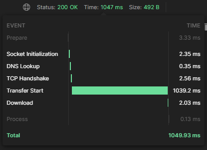
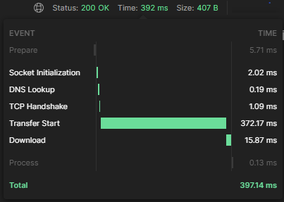

# Spring Reactive

Spring Reactive, a pilha reativa do spring para construir serviços web não bloqueantes com baixa latência e alto throughput.
São 2 projetos para comparar a reativa com a servlet em relação a implementação. 
No final, é feito um pequeno benchmark para avaliar a performance de ambas.

### Requisitos

	
	
	
	
	

## Benchmark 

Servlet Api

Reactive Api

